# 🌻 Plants vs Zombies

## Project Overview

The zombies are coming, and they're hungry for brains! In this tower defense game, you must defend your home by strategically planting various types of plants, each with unique abilities. From basic pea shooters to explosive jalapeños, build your garden defense and survive waves of increasingly dangerous zombies.

Battle through different environments from your backyard lawn to the rooftop, facing off against zombies wearing traffic cones, buckets, and even a massive Gargantuar boss. Can you protect your house from the zombie invasion?

---

## Features

### 🎮 Game Content
- **11 Plant Types** – Each with unique defensive abilities
- **10 Zombie Varieties** – From basic shamblers to armored threats
- **5 Challenging Levels** – Different environments and difficulties

### 🧩 User Interface
- **Level Selection Menu** – Choose your battlefield
- **Plant Selection** – Pick your defensive strategy
- **Main Menu** – Clean game navigation
- **Credits Menu** – Meet the development team
- **Options Menu** – Customize your experience
- **Pause Menu** – Strategic breaks during gameplay
- **Win/Lose Screens** – Victory celebrations and defeat notifications

---

## 🌿 Plants

- **Ice Shroom** – Freezes all zombies on screen  
- **Ice Pea Shooter** – Shoots frozen peas that slow zombies  
- **Jalapeño** – Burns entire lane of zombies  
- **Pea Shooter** – Basic projectile plant  
- **Planting Pot** – Enables planting on roof levels  
- **Potato Mine** – Explodes when zombies step on it  
- **Puff Shroom** – Short-range spore shooter  
- **Scaredy Shroom** – Hides when zombies approach  
- **Sunflower** – Produces sun energy for planting  
- **Sun Shroom** – Night-time sun producer  
- **Wall Nut** – Defensive barrier plant  

---

## 🧟 Zombies

- **Bucket Head** – Heavy bucket armor protection  
- **Cone Head** – Traffic cone helmet for extra durability  
- **Default** – Basic shambling zombie  
- **Football** – Fast-moving armored zombie  
- **Gargantuar** – Massive boss zombie with enormous health  
- **Imp** – Small, quick-moving zombie  
- **Jack in the Box** – Explosive zombie that damages plants  
- **News Man** – Newspaper-reading zombie  
- **Pole Vault** – Jumps over the first plant in its path  
- **Screen Door** – Shield-carrying zombie  

---

## 🗺️ Levels

1. **Day Grass** – Sunny lawn with full sun production  
2. **Night Grass** – Dark lawn with limited sun availability  
3. **Fog** – Limited visibility adds strategic challenge  
4. **Day Roof** – Rooftop battle requiring planting pots  
5. **Night Roof (Boss Fight)** – Final rooftop showdown with the ultimate challenge  

---

## 📸 Screenshots

### 🧭 Menus

- **Main Menu**  
  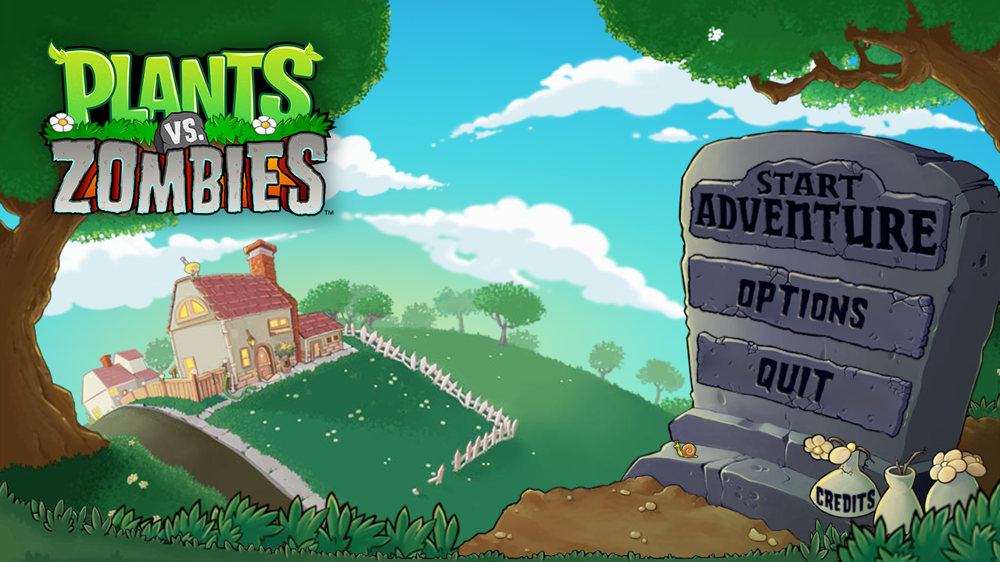

- **Level Selection**  
  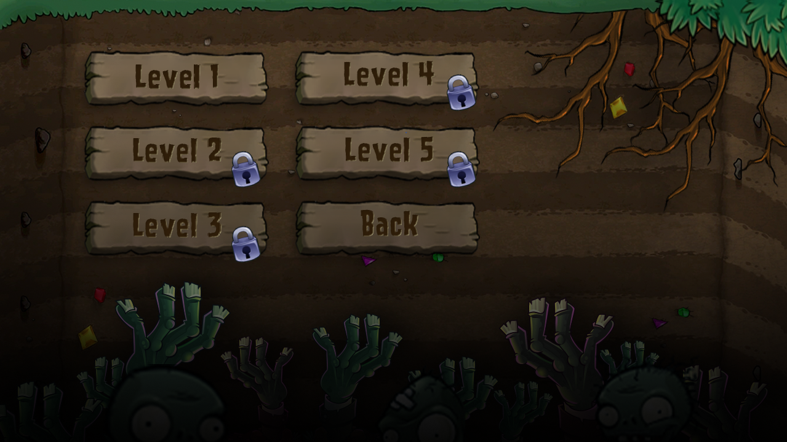

- **Credits**  
  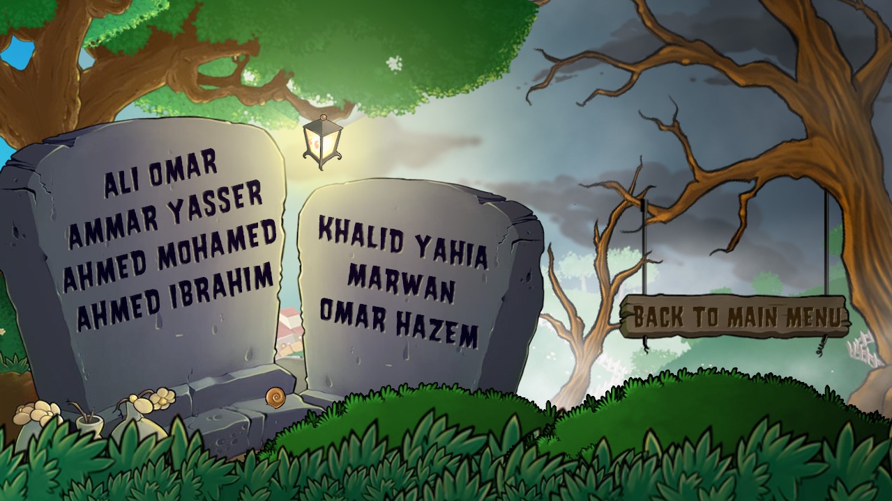

- **Options**  
  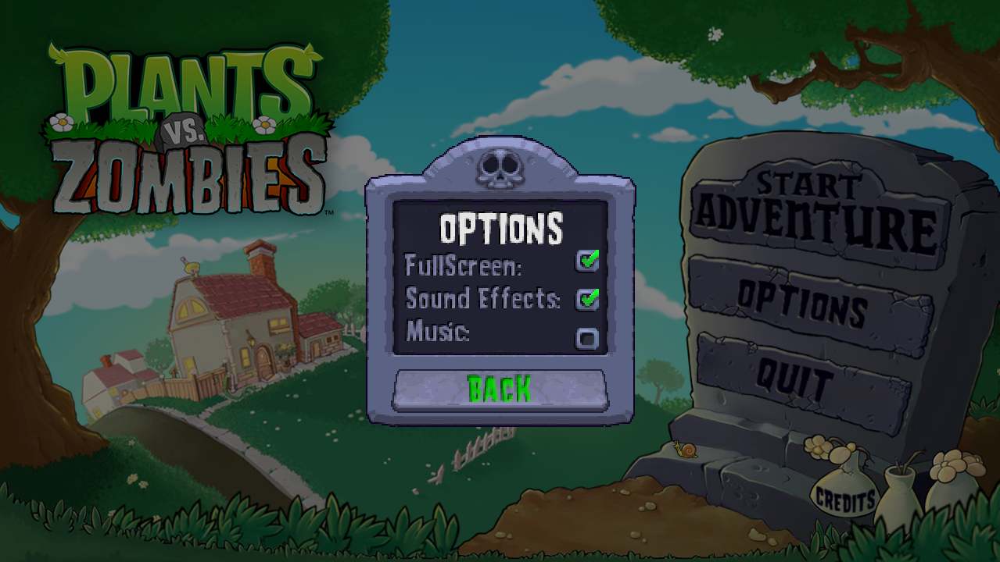

  
📋 In-Game Menus (Click to Expand)

- **Pause Menu**  
  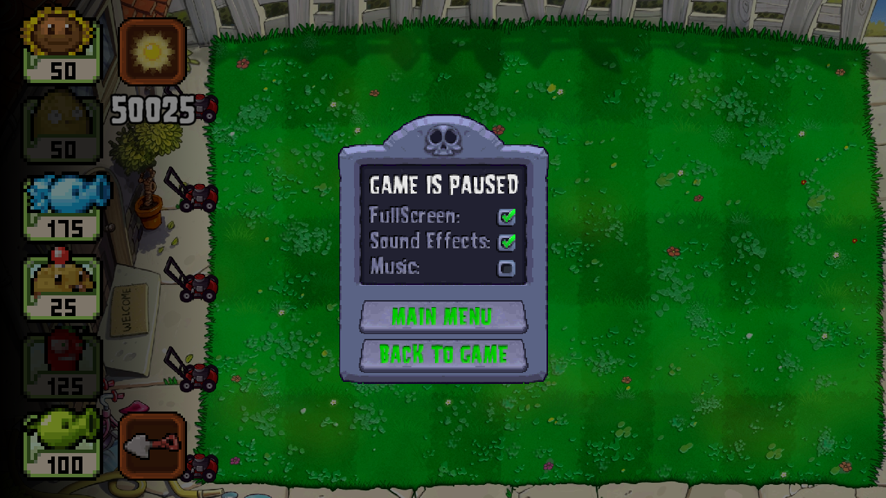

- **Win Screen**  
  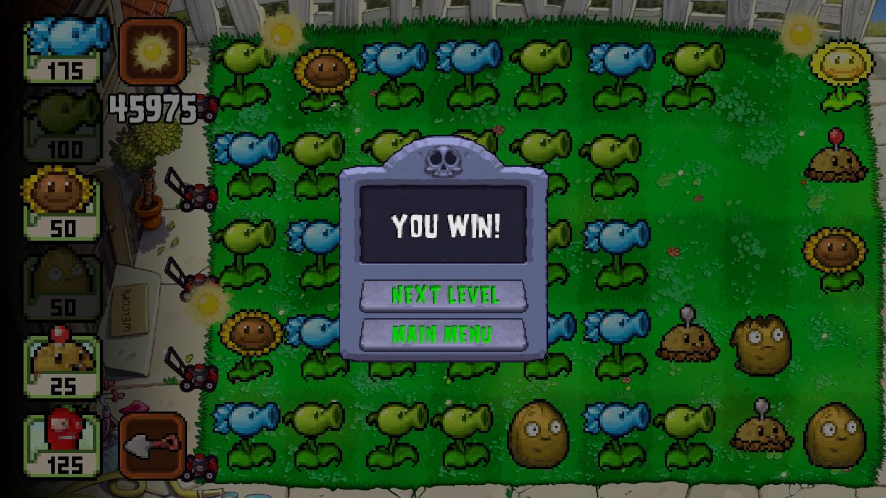

- **Loss Screen**  
  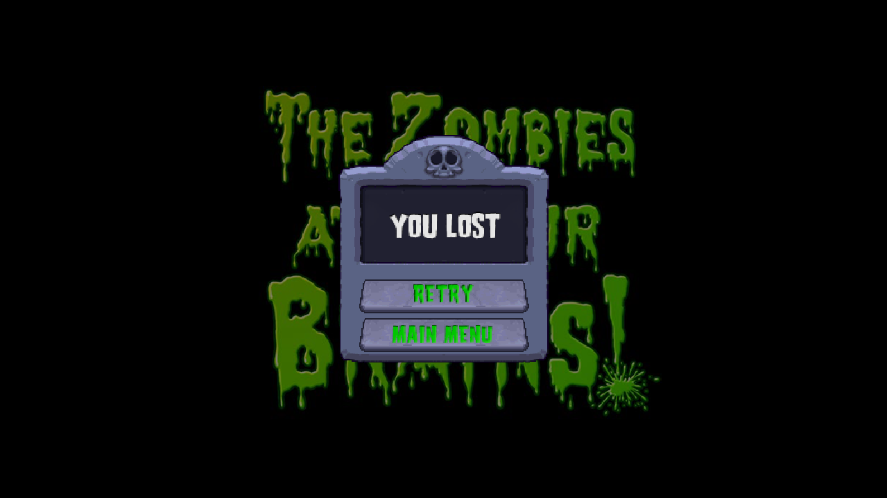

- **Plant Selection**  
  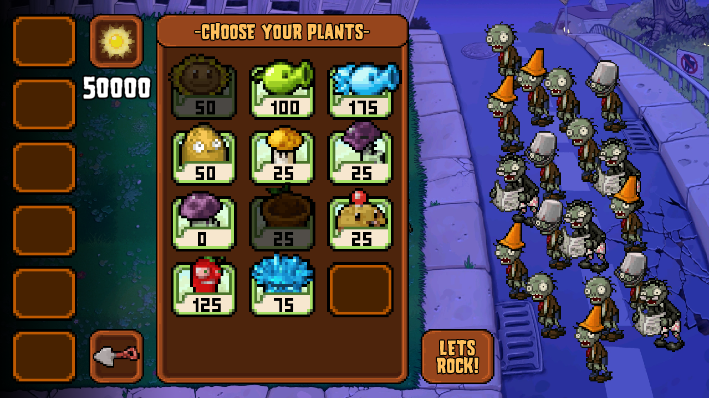

---

### 🗺️ Level Screenshots

- **Level 1 (Day Grass)**  
  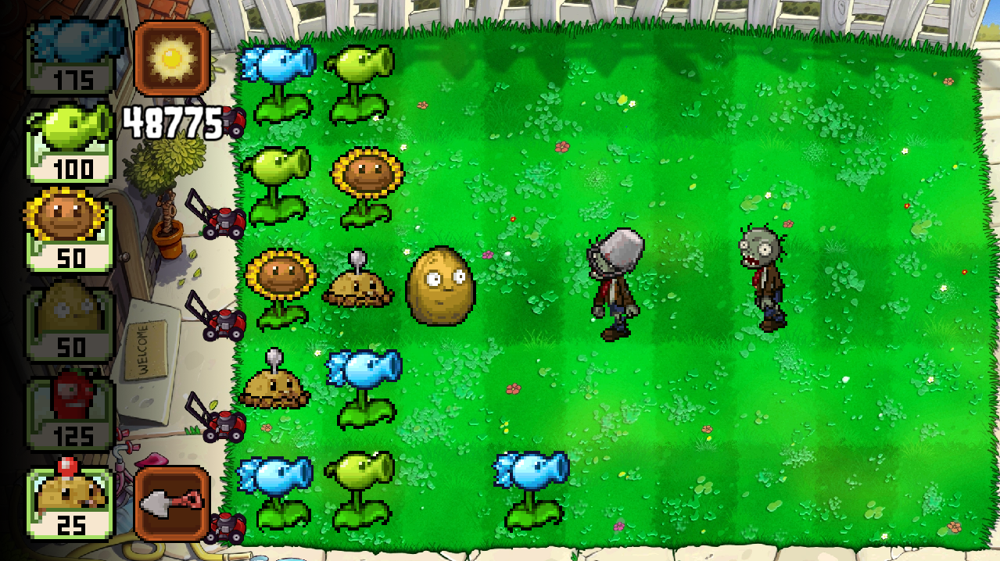

- **Level 2 (Night Grass)**  
  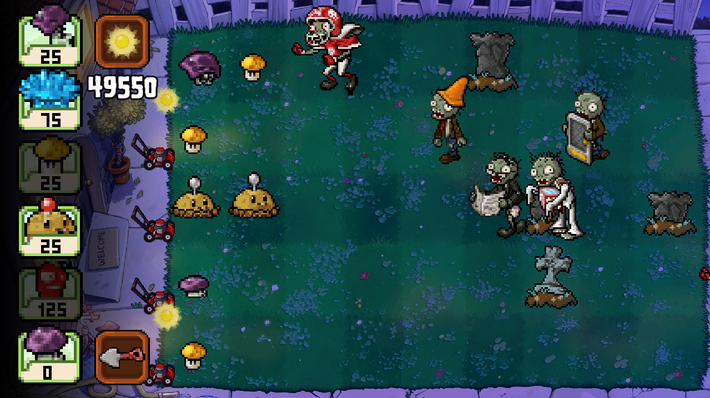

- **Level 3 (Fog)**  
  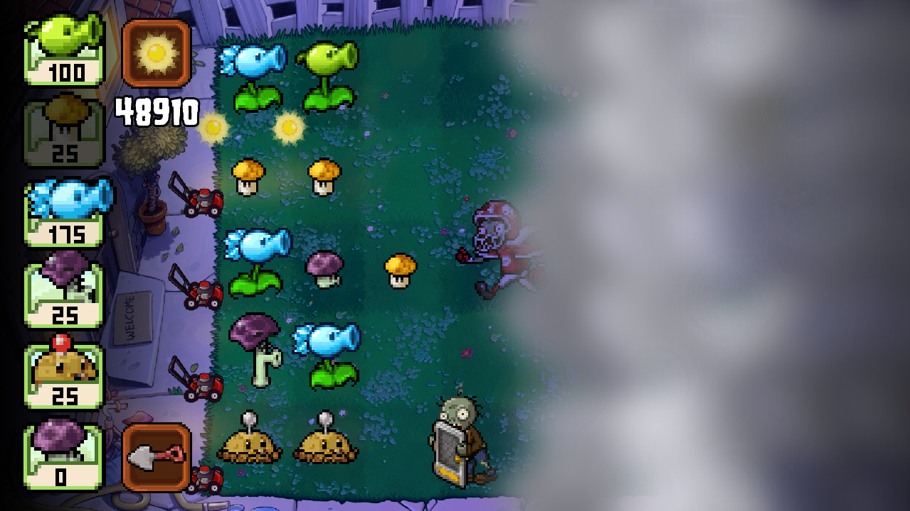

- **Level 4 (Day Roof)**  
  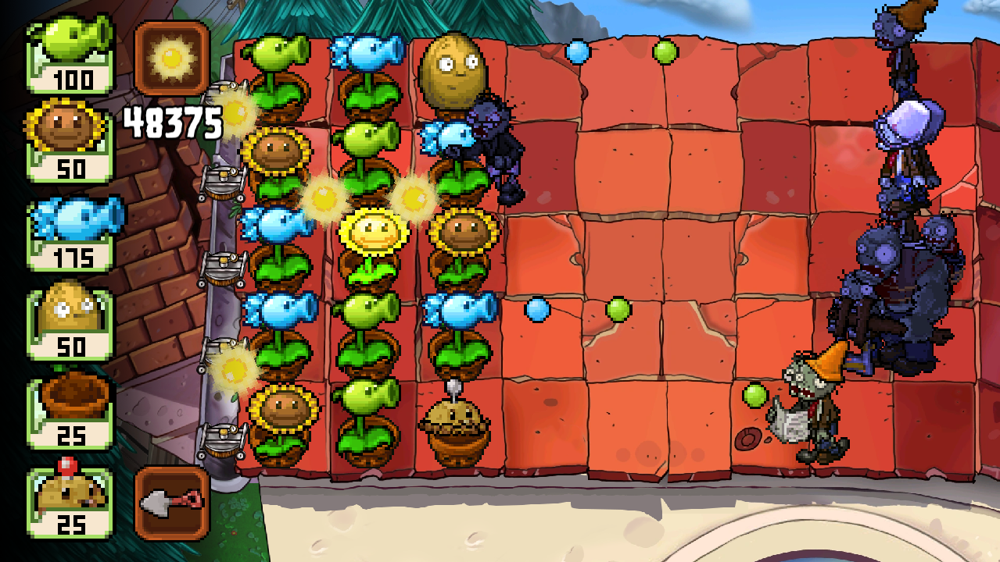

- **Level 5 (Night Roof - Boss Fight)**  
  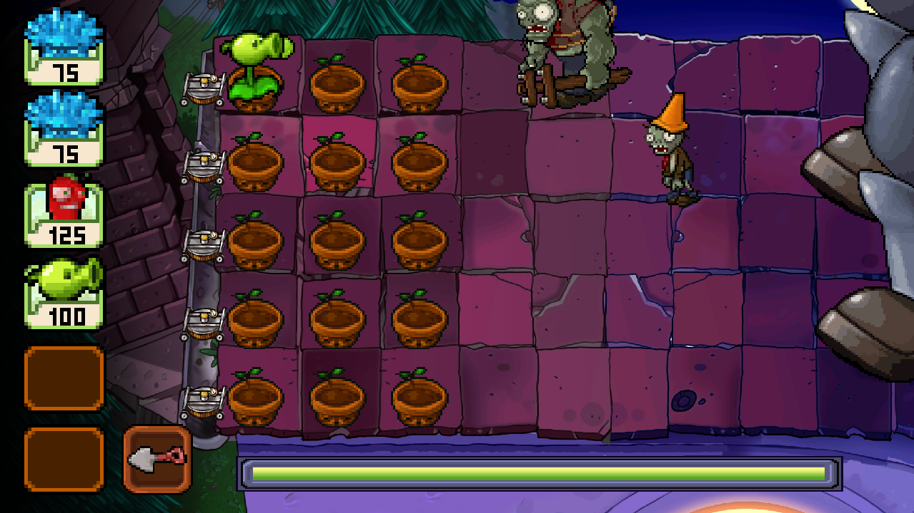

---

## 👥 Contributors

- **Ahmed Fathy** – [GitHub Profile](https://github.com/ahmedmhfathy)
- **Khalid Yahia** – [GitHub Profile](https://github.com/khalid-zeidan)
- **Omar Hazem** – [GitHub Profile](https://github.com/omarhazem94)
- **Ali Omar** – [GitHub Profile](https://github.com/Atomic5577)
- **Ammar Yasser** – [GitHub Profile](https://github.com/Ammar-Yasser-13)
- **Ahmed Ibrahim** – [GitHub Profile](https://github.com/rudy1325)
- **Marawan Ahmed** – [GitHub Profile](https://github.com/maro2422007)
